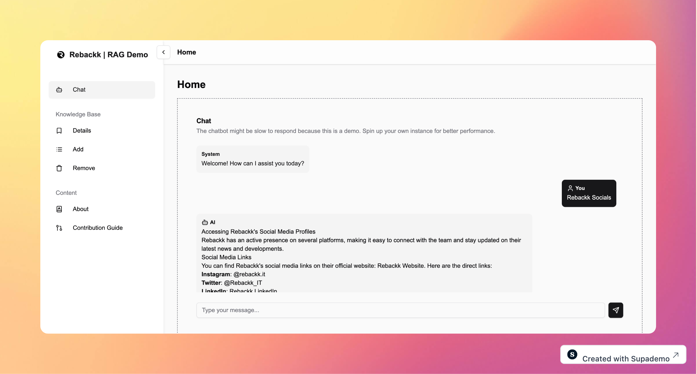

# Next.js RAG (Retrieval-Augmented Generation)

**Next.js RAG** is an open-source project that implements a Retrieval-Augmented Generation (RAG) feature using **Next.js**, **Langchain**, and **Ollama**. This project is designed to help developers integrate RAG capabilities into their Next.js applications, offering real-time, data-driven insights powered by language models.

This project is an extraction of a core feature embedded in **Rebackk** to enhance AI capabilities in customer interactions and security incident management. While the embedded version remains private, we are excited to offer this open-source version to help others leverage RAG in their own applications.

## Features

- **Retrieval-Augmented Generation**: Integrates external data sources to enrich language model responses.
- **Next.js-based**: Fully server-side and API routes support for efficient querying and responses.
- **Langchain integration**: Handles retrieval and orchestration of large language models (LLMs) and external data.
- **Ollama-powered**: Utilizes Ollama for generating responses based on retrieved data.
- **Extensible**: Easily customizable and extendable to support additional data sources or LLMs.
- **Open-source**: Available to the developer community to build intelligent chatbots, dynamic FAQs, automated customer support, etc.

## Use Cases

- **Customer Support**: Build an intelligent FAQ or support system to answer customer queries based on real-time data.
- **Knowledge Base**: Provide accurate, up-to-date information from a dynamic knowledge base, including documentation or stored articles.
- **Security Incident Management**: Use RAG to manage security incidents, retrieve historical data, and provide recommended solutions based on past incidents. (As Used By Rebackk)

## Top Contributors

Made with [Contrib.rocks](https://contrib.rocks)

### Stats

## License

This project is licensed under the MIT License.

## Acknowledgments

- [Next.js](https://nextjs.org/)
- [Langchain](https://js.langchain.com/docs/introduction/)
- [Ollama](https://github.com/Ollama/ollama)
- [Vercel AI SDK](https://sdk.vercel.ai/)